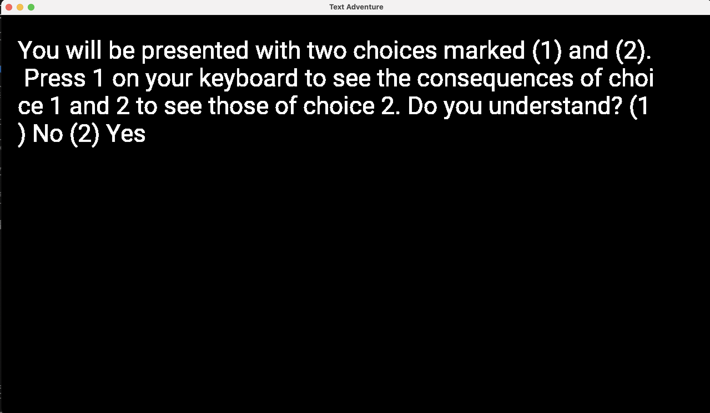

# Text Adventure

Author: Ari Liloia

Design: My game is a text-based adventure game that presents the user with two options regarding how to proceed.

Text Drawing: A "choices.csv" file with the text to be displayed on the screen and the destination pages for choice 1 or 2 is loaded at the beginning of the game. When a new page is loaded, the text is shaped using harfbuzz, converted to a bitmap with freetype, and converted to pixels and displayed as a texture using OpenGL. 
Text is rendered at runtime whenever a page is changed. The files involved are dist/choices.csv, and the actual rendering is done in PlayMode.cpp. 

Choices: The game stores choices and narrative in a vector of Page structs; each Page contains the text to display, its own page number, and the page numbers of the two choices outlined in the text. Each page is loaded from a line of dist/choices.csv. I wanted to display the choices on separate lines of text, smaller, and with a different color, but didn't have time to implement this. 

Screen Shot:

How To Play:
Press 1 to choose the first option and 2 to choose the second. Play until bored.

Sources: 
I used the Roboto Regular font by Christian Robertson:
https://fonts.google.com/specimen/Roboto
A license (LICENSE.txt) is included in dist/game and in the home directory.

This game was built with [NEST](NEST.md).

